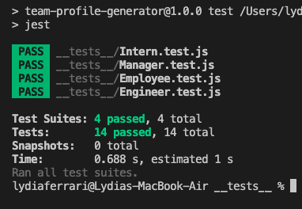

# Team Profile Generator

<a name="description"></a>

## Description
The purpose of this program was to create a tool where any team could quickly generate user profiles containing the basic information for their team members. One key advantage to this is it's easy-to-use command-line interface with node.js that delivers a series of prompts to the creator and quickly generates a sleek and polished HTML document displaying every member of the team including a Manager, and as many Engineers and Interns as they may need.

[](https://opensource.org/licenses/MIT)

## Table of Contents
- [Description](#description)
- [User Story](#userstory)
- [Acceptance Criteria](#acceptancecriteria)
- [Installation](#installation)
- [Usage](#usage)
- [License](#license)
- [Contributing](#contributing)
- [Tests](#test)
- [Questions](#questions)
- [Video](#video)
- [Screenshots](#screenshots)
- [Links](#links)
- [Resources / Credits](#credits)


<a name="installation"></a>

## Installation
* Clone the repository using:

```
git clone https://github.com/jonteal/team-profile-generator
```
* Be sure that you are in the current working directory
* Install the dependencies ( jest and inquirer) by opening the terminal and running
```
npm install
```
* Run the project by typing the following command in the terminal:
```
node index.js
```

<a name="usage"></a>

## Usage
* In order to access the user questions, open the terminal (right click index.js and click 'open in integrated terminal')
* Answer all prompted questions until the terminal reads "Your team is being generated!"
* To view the index.html, right click on the file and select 'open in default browser', or (if you have Live Server), 'open with live server'.


<a name="license"></a>

## License
Permission is hereby granted, free of charge, to any person obtaining a copy of this software and associated documentation files (the "Software"), to deal in the Software without restriction, including without limitation the rights to use, copy, modify, merge, publish, distribute, sublicense, and/or sell copies of the Software, and to permit persons to whom the Software is furnished to do so, subject to the following conditions:

The above copyright notice and this permission notice shall be included in all copies or substantial portions of the Software.

THE SOFTWARE IS PROVIDED "AS IS", WITHOUT WARRANTY OF ANY KIND, EXPRESS OR IMPLIED, INCLUDING BUT NOT LIMITED TO THE WARRANTIES OF MERCHANTABILITY, FITNESS FOR A PARTICULAR PURPOSE AND NONINFRINGEMENT. IN NO EVENT SHALL THE AUTHORS OR COPYRIGHT HOLDERS BE LIABLE FOR ANY CLAIM, DAMAGES OR OTHER LIABILITY, WHETHER IN AN ACTION OF CONTRACT, TORT OR OTHERWISE, ARISING FROM, OUT OF OR IN CONNECTION WITH THE SOFTWARE OR THE USE OR OTHER DEALINGS IN THE SOFTWARE.


<a name="contributing"></a>

## How to Contribute
1. [Fork the repo!](https://docs.github.com/en/get-started/quickstart/fork-a-repo)
2. Create a feature branch:
```
git checkout -b yourname-branch
```
3. Commit changes:
```
git commit -m 'Your changes here'
```
4. Push to the branch:
```
git push origin yourname-branch
```
5. Submit a pull request and wait for it to be approved or denied.

<a name="tests"></a>

## Tests
1. Ensure that jest is installed in your directory. This should have been done earlier when you ran 'npm install' in the command line.
2. In the command line, write:
```
npm run test
```
3. Confirm all four test files pass (screenshots included below). Test files are located in the tests folder and are titled: Employee.test.js, Engineer.test.js, Manager.test.js, and Intern.test.js.


<a name="questions"></a>

## Questions
If you have any questions or comments, please feel free to contact me by email at jonjacksonvibes@gmail.com!


<a name="video"></a>

## Video
View video: https://drive.google.com/file/d/1njFioaDhMvYOXSTD8hJGW8zLPcn_6ua7/view

<a name="screenshots"></a>

## Screenshots




<a name="links"></a>

## Links
Github Repository: https://github.com/jonteal/team-profile-generator


<a name="credits"></a>

## Resources / Credits
This project was authored by Jon Jackson, but had some logical guidance by fellow cohort members Ryan Paragas and Laurel Thornburn, as well as tutor Robert Parsons.


